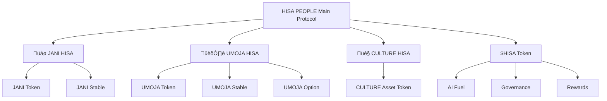

# Project HISA: Unified Hedera Ecosystem Application

# HISA People Chain Protocol Structure



## Protocol Components

### Main Protocol
- **HISA PEOPLE Main Protocol** - Main  framework

### Branch Protocols
- **üåø JANI HISA** - Environmental conservation branch
- **🏛️ UMOJA HISA** - Community asset management branch  
- **🎤 CULTURE HISA** - Cultural preservation branch

### Token Structure
- **$HISA Token** - Core utility token (AI Fuel, Governance, Rewards)
- **JANI Token** - Environmental  conservation database with rewards
- **JANI Stable** - Green economy stablecoin
- **UMOJA Token** - Asset tokenization
- **UMOJA Stable** - Asset trading liquidity
- **UMOJA Option** - Asset speculation mechanism
- **CULTURE Asset Token** - preserve Culture via NFTs with royalties

## Overview

Project HISA is a comprehensive decentralized application (dApp) built on the **Hedera Hashgraph** network. It integrates four core MVP modules—**Jani** (environmental conservation and regeneration), **Hisa** (AI-powered telemedicine), **Umoja** (decentralized finance and asset tokenization), and **Chat** (cultural heritage preservation)—to address challenges in sustainability, health, culture, and economic inclusion. Leveraging Hedera's high-throughput, low-cost, and carbon-negative consensus, alongside **Kabila** for decentralized storage, the platform ensures data integrity, transparency, user sovereignty, and scalability.

The app supports seamless wallet integrations with **HashPack** and **MetaMask**, enabling users to connect wallets, query balances, send/receive tokens, and perform updates. AI agents across modules can query balances and facilitate dynamic interactions for enhanced user experience.

---

## Core MVP Features & Technical Implementation

### 1. Wallet Integration: HashPack and MetaMask

**Objective:** Enable seamless wallet connectivity for querying balances, sending/receiving tokens, updates, and AI-driven interactions across all modules.

**MVP Implementation Steps:**

- **Deployment on Hedera:** Set up the dApp on the Hedera mainnet/testnet for efficient, low-fee operations.
- **HashPack Integration:** Use the HashPack SDK to connect Hedera-native wallets, allowing users to query HBAR/token balances, send/receive transactions, and update account details.
- **MetaMask Integration:** Bridge MetaMask via Hedera's Token Service (HTS) for Ethereum-compatible wallet support, enabling cross-chain queries and transactions without full EVM reliance.
- **AI-Enabled Features:** Integrate AI agents (e.g., in Hisa and Umoja modules) to query wallet balances, recommend actions (e.g., based on conservation rewards or financial data), and automate updates like token transfers or staking.

**Key MVP Benefits:** Low barriers to entry, real-time balance visibility, and secure, user-controlled interactions.

---

### 2. Jani: Blockchain-Powered Conservation & Environmental Regeneration

**Objective:** Incentivize and verify environmental conservation efforts like reforestation, carbon offsets, and sustainable land management using blockchain for transparency and rewards.

Data Collection & Verification
üîπ How it Works

A validator sends a POST request:

{ "treeId": "T1234", "species": "Acacia", "gps": [1.2921, 36.8219], "plantedBy": "walletXYZ", "validator": "Austin", "status": "Growing" }

Express hashes this record.

MongoDB saves the full record + hash.

Hedera stores the hash + validator info in the Consensus Service

**MVP Implementation Steps:**

- **Hedera Guardian Integration:** Leverage Hedera Guardian for policy definition, verification of conservation claims (e.g., tree planting, CO2 sequestration), and issuance of verifiable credentials.
- **Proof of Growth (PoG) Mechanism:** Mint 1 JANI token per verified tree planted, using IoT sensors, AI validation, and satellite monitoring. Track growth metrics and mint NFTs for carbon offsets (e.g., bamboo projects).
- **Data Storage with Kabila:** Store large datasets, including geotagged images, growth proofs, sensor readings, and NFT metadata, on Kabila (IPFS/Filecoin-based decentralized storage). Content Identifiers (CIDs) are recorded on Hedera.
- **Consensus & Transparency:** Log all events (e.g., planting verifications, token minting) on Hedera Consensus Service (HCS) for immutable, auditable records. AI agents can query JANI token balances and update project statuses.
- **Tokenomics & Rewards:** Initial supply of 50M JANI tokens; staking rewards (e.g., higher APY for youth/women groups); deflationary mechanisms like token burns from transactions.
- **MVP Focus:** Mobile app for data collection, real-time dashboard for impact tracking, and DAO governance for fund allocation (e.g., 40% to tree-planting funds).

**Key MVP Benefits:** Transparent carbon credits, community incentives via JANI tokens, and scalable environmental impact measurement with youth/women empowerment.

---

### 3. Hisa: AI-Powered Telemedicine

**Objective:** Provide secure, AI-driven initial health assessments with privacy-focused data handling for mental and emotional well-being.

**MVP Implementation Steps:**

- **AI Agent Development:** Build an agentic AI (using frameworks like LangChain or AutoGen) for user interactions via chat/voice. It assesses emotional/mental states, provides basic recommendations, and escalates to professionals if needed.
- **Dynamic Features:** AI can query user wallet balances (e.g., for health incentive tokens), send/receive data (e.g., encrypted reports), and update records (e.g., session logs or wellness plans).
- **Secure Data Handling:** Encrypt and store interaction data, anonymized records, and images on Kabila. User consent is managed via Hedera Account IDs.
- **Auditable Logging:** Record session hashes and key events on Hedera Consensus Service (HCS) for transparency without exposing sensitive data on the public ledger.
- **Wallet & Balance Integration:** Link to HashPack/MetaMask for querying health-related token balances, enabling AI to suggest or automate reward transfers.
- **MVP Focus:** Basic emotional assessment, gamification for wellness tasks, and integration with microfinance groups for transparent health incentives.

**Key MVP Benefits:** Accessible mental health support, privacy compliance, and interactive AI for personalized care with financial incentives.

---

### 4. Umoja: Decentralized Finance & Asset Tokenization

**Objective:** Break financial exclusion cycles by enabling asset tokenization, liquidity provision, and inclusive DeFi for Kenyans.

**MVP Implementation Steps:**

- **Liquidity Pools:** Integrate with Hedera-native DEXs like HeliSwap, HSuite and  SaucerSwap for pooling, swapping, and yield farming. AI can query pool balances and suggest optimizations.
- **Asset Tokenization as a Service (TaaS):** Tokenize RWAs (e.g., land, real estate, infrastructure bonds) using Hedera Token Service (HTS). Store documents/images on Kabila, with on-chain references.
- **Triple-Token Model:** UMOT (governance/utility), UMOS (stablecoin backed by BTC, gold, bonds), UMOO (options/meme token). Enable fractional investments starting at KSh 100.
- **Dynamic AI Features:** AI agents handle balance queries, automated swaps, sends/receives, and updates (e.g., rebalancing portfolios or yield optimization).
- **Consensus Logging:** Record all transactions on HCS for transparent, verifiable financial history.
- **MVP Focus:** Umoja Central Securities Exchange (UCSE) for SME tokenization, DAO governance, and regulatory compliance (e.g., CMA, KRA integration).

**Key MVP Benefits:** Unlocked liquidity for idle assets, reduced debt dependency, and AI-driven financial efficiency for inclusive prosperity.

---

### 5. Chat: Cultural Heritage Asset Tokens

**Objective:** Preserve and monetize African cultural heritage through tokenization, ensuring community control and economic sustainability.

**MVP Implementation Steps:**

- **NFT Minting & Storage:** Tokenize tangible/intangible assets (e.g., rock art, oral traditions) using Hedera Token Service (HTS). Store media and metadata on Kabila, with CIDs linked to NFTs for provenance.
- **Marketplace Integration:** Connect to Hedera-native marketplaces for trading, royalties (5% to conservation funds), and fractional ownership.
- **AI Enhancements:** Use AI for metadata tagging (e.g., dialect analysis), content curation, and querying NFT-related balances. AI can update listings or recommend trades.
- **Consensus & Provenance:** Log all mints, transfers, and sales on HCS for immutable ownership history.
- **Tokenomics & Governance:** 21B CHAT tokens; utilities for payments, staking (5-15% APY), and governance. Community DAOs with quadratic voting.
- **MVP Focus:** Offline-inclusive design (USSD/voice entry), privacy controls (ZK-proofs), and AR/VR access for educational content.

**Key MVP Benefits:** Democratized cultural monetization, ethical preservation, and community-driven governance with AI synergy.

---

## Unifying Hedera Ecosystem Integration

**Objective:** Provide a cohesive foundation for all modules with emphasis on data integrity and scalability.

**MVP Implementation Steps:**

- **Hedera Consensus Service (HCS):** Central to all modules for timestamping events, ensuring immutability, and enabling audits.
- **Kabila Storage:** Used across the app for large-scale data (e.g., images, videos, records), integrated with Hedera for CID anchoring.
- **AI Across Modules:** Agentic AI (e.g., via Semantic Kernel) for querying balances, updates, and interactions, ensuring dynamic functionality.
- **Tools Stack Alignment:** Incorporates Hedera tools like Stablecoin Studio, Asset Tokenization Studio, Mirror Node API, and Guardian for real-time data and compliance.

**Key MVP Benefits:** Seamless interoperability, regulatory compliance, and a robust, future-proof ecosystem.

---

## Technology Stack

| Component                  | Technology/Tool                  | Purpose                          |
|----------------------------|----------------------------------|----------------------------------|
| **Blockchain Network**    | Hedera Hashgraph (HBAR)         | Core consensus and transactions |
| **Consensus Mechanism**   | Hedera Consensus Service (HCS)  | Immutable logging and timestamps |
| **Tokenization**          | Hedera Token Service (HTS)/HSuite      | NFTs, RWAs, and utility tokens  |
| **Storage**               | Kabila / HCS          | Decentralized data/images/videos|
| **DEX Integration**       | HeliSwap/SaucerSwap SDK         | Liquidity and swaps             |
| **AI Frameworks**         | LangChain/AutoGen/Semantic Kernel| Agentic AI for queries/updates  |
| **Wallets**               | HashPack/MetaMask               | Connectivity and balance management |
| **Explorers/Analytics**   | HashScan/Dragonglass            | Real-time monitoring            |

---


This MD file serves as an MVP blueprint for development. For implementation code, audits, or expansions, consult Hedera docs or reach out for custom support.
text### Assumed CSS for Styling

Convert this to Tailwind classes in components:

```css
/* Assumed CSS for HISA dashboards */
body {
    font-family: Arial, sans-serif;
    background-color: #f4f4f9;
    margin: 0;
    padding: 20px;
}
nav {
    background-color: #1a202c;
    padding: 1rem;
    color: white;
}
nav a {
    color: #a0aec0;
    margin-right: 1rem;
    text-decoration: none;
}
nav a:hover {
    color: #ffffff;
}
section {
    background-color: white;
    border-radius: 8px;
    padding: 20px;
    margin-bottom: 20px;
    box-shadow: 0 2px 4px rgba(0,0,0,0.1);
}
h1, h2 {
    color: #2d3748;
}
button {
    background-color: #2b6cb0;
    color: white;
    padding: 10px 20px;
    border: none;
    border-radius: 4px;
    cursor: pointer;
}
button:hover {
    background-color: #2c5282;
}
.card {
    border: 1px solid #e2e8f0;
    padding: 1rem;
    margin: 0.5rem;
    border-radius: 8px;
}
.card h3 {
    margin: 0 0 0.5rem;
}
.notification {
    background-color: #edf2f7;
    padding: 0.5rem;
    margin: 0.5rem 0;
}
.table {
    width: 100%;
    border-collapse: collapse;
}
.table th, .table td {
    border: 1px solid #ddd;
    padding: 8px;
}
.table th {
    background-color: #f2f2f2;
}
Additional Requirements

For Jani: Form for POST-like data submission, hash it (use crypto-js), store mock in localStorage, log to HCS via sdk.
For Hisa: Chat interface with LangChain for AI responses (mock health assessments).
For Umoja: Mock tokenization form, DEX swap simulator.
For Chat: NFT mint form, upload to IPFS, mint via HTS.
Use responsive Tailwind (e.g., grid-cols-1 md:grid-cols-3).
Handle WalletConnect for HashPack with project ID.
Simulate AI with prompts like "Query balance and recommend action".
Ensure app is testable on localhost:5173.

Provide the complete code structure for all files, faithfully implementing the MVP as React components with Tailwind.30 web pagesimagine you were a developer and these were some of the feature you wish to integeate in your hisa project using js and ts create a prompt that an agentic coding agent can use can use to create a full fuctional app deployable 4 mainnet but focus on the test net hedera on hashing and using mongo db  use firebase create my hisa dapp prompt Thought for 9sPrompt for Agentic Coding Agent
As a developer building the Project HISA dApp, create a fully functional, fullstack decentralized application (dApp) using JavaScript and TypeScript. The app implements the MVP features from the "Project HISA: Unified Hedera Ecosystem Application" MD document, focusing on the Hedera Testnet for all blockchain operations (e.g., wallet connections, token minting, HCS logging). Make it deployable to mainnet by using environment variables to switch networks (e.g., TESTNET vs MAINNET). Use hashing for data integrity (e.g., SHA-256 via crypto-js for records before HCS submission). Integrate MongoDB for persistent storage (e.g., user data, conservation records) via Mongoose. Use Firebase for authentication (Firebase Auth with email/password or Google sign-in, linking to Hedera accounts) and real-time features (Firestore for live updates like notifications or chat in Hisa module).
The dApp is a unified dashboard with navigation to: Main Protocol Overview (with Mermaid diagram), Jani (conservation), Hisa (telemedicine), Umoja (DeFi/tokenization), and Chat (cultural heritage). Use Next.js (TS) for the frontend (React-based, with SSR for SEO), React Router or Next.js routing for navigation. Backend: Node.js/Express (TS) for APIs, handling Hedera interactions, MongoDB CRUD, Firebase integration, and hashing. Use Hedera Testnet by default:

For MetaMask: Add network with RPC URL https://testnet.hashio.io/api, Chain ID 296, Symbol HBAR, Explorer https://hashscan.io/testnet.
For HashPack: Use @hashgraph/hashconnect with LedgerId.TESTNET and a WalletConnect project ID (placeholder <YOUR_WALLETCONNECT_PROJECT_ID>; instruct to replace).
For mainnet switch: Env vars like NETWORK=TESTNET or MAINNET, updating RPC to https://mainnet.hashio.io/api, Chain ID 295, Explorer https://hashscan.io/mainnet, and LedgerId.MAINNET.

Key integrations:

Wallet (HashPack & MetaMask): Connect via @hashgraph/hashconnect (HashPack) and ethers (MetaMask). Query HBAR balances (sdk for HashPack, ethers provider for MetaMask), enable send/receive HBAR/tokens. Display status in Navbar. Use Firebase Auth to persist user sessions, linking wallet addresses to Firebase UID.
Hashing & HCS: For data (e.g., Jani tree records), hash with crypto-js (SHA-256), store full data in MongoDB, submit hash to HCS topic via @hashgraph/sdk. Create/submit to a testnet topic (e.g., for verifications).
MongoDB: Use Mongoose schemas for models (e.g., TreeRecord: {treeId, species, gps, hash, hederaTopicId}). Connect via env var MONGODB_URI.
Firebase: Admin SDK for backend auth verification; client-side for login/signup, real-time Firestore listeners (e.g., Hisa chat sessions, Jani notifications). Store anonymized data, link to Hedera Account IDs.
Kabila/IPFS Sim: Use nft.storage for file uploads (images/metadata), anchor CID to HCS.
AI Simulation: Use @langchain/core for mock agentic AI (e.g., in Hisa: prompt-based emotional assessment; in Umoja: balance queries/recommendations). No real LLM; use hardcoded responses or simple logic.
Hedera Services: HTS for token/NFT minting (mock JANI, UMOT, etc., on testnet), HCS for logging, Mirror Node for queries.
DEX Mock: Simulate HeliSwap/SaucerSwap with ethers for swaps in Umoja.

Style with Tailwind CSS (Next.js integration). Responsive, modern UI. Use TypeScript for type safety. Handle errors (e.g., wallet not installed, network mismatch) with toasts (react-hot-toast).
Bootstrap with:

Frontend: Next.js 14+ (TS), pages/router.
Backend: Express TS, with CORS for frontend.
Deployment: Vercel for frontend (env vars for network), Heroku/Render for backend (with MongoDB Atlas, Firebase config). Include vercel.json and Procfile. Testnet focus: Default envs point to testnet; mainnet via separate deployment.

Install deps:

Frontend: next, react, react-dom, @types/react, typescript, tailwindcss, postcss, autoprefixer, react-router-dom (if needed), ethers, @hashgraph/hashconnect, @hashgraph/sdk, langchain, @langchain/core, nft.storage, firebase, react-hot-toast, react-mermaid.
Backend: express, @types/express, typescript, ts-node, mongoose, crypto-js, @hashgraph/sdk, firebase-admin, dotenv, cors, helmet.

Structure:

/frontend: Next.js app.

pages/index.tsx: Main dashboard with Mermaid (react-mermaid2), protocol overview.
pages/jani.tsx: Jani form for tree data (POST to backend, hash, MongoDB + HCS).
pages/hisa.tsx: AI chat interface (Firebase real-time, mock LangChain assessment).
pages/umoja.tsx: Tokenization form, mock DEX swap.
pages/chat.tsx: NFT mint/upload (IPFS + HTS).
components/Navbar.tsx: Navigation, wallet buttons, Firebase auth.
components/WalletConnect.tsx: Connections, balances (query on connect/update).
lib/hedera.ts: TS utils for sdk, hashing, HCS.
lib/firebase.ts: Client config.


/backend: Express TS server.

server.ts: App setup, routes (/api/jani, /api/hcs-submit, etc.).
models/TreeRecord.ts: Mongoose schema.
controllers/hederaController.ts: HCS submit, HTS mint (testnet client).
middleware/auth.ts: Firebase ID token verification.
lib/mongo.ts: Connection.
lib/firebaseAdmin.ts: Admin init.
lib/hashUtils.ts: SHA-256 hashing.


package.json (separate for front/back), tsconfig.json, tailwind.config.js, .env.example (with placeholders for API keys, Mongo URI, Firebase, WalletConnect ID).
Deployment scripts: deploy.sh for Vercel/Heroku.

Simulate features:

Jani: Form submits {treeId, species, gps, etc.}, hash record, save to Mongo, submit hash to HCS topic (create if needed).
Hisa: Chat component with input, mock AI response via LangChain prompt, log to Firestore + HCS hash.
Umoja: Tokenize asset (upload doc to IPFS, mint HTS token), mock swap.
Chat: Upload media to IPFS, mint NFT via HTS, log to HCS.
Auth: Firebase login required for modules; link wallet on connect.

Ensure testnet safety: No real funds; use faucet HBAR. For mainnet: Comment instructions to update envs, deploy separately. Provide full code, including setup commands (npm install, yarn dev). Run on localhost:3000 (front), :5000 (back).
Provided MD Content (Base for Components)
[Insert the full MD content from previous messages here, including Mermaid, sections, tech stack table.]
Assumed CSS (Convert to Tailwind)
[Insert the CSS from previous prompt.]
Additional Requirements

Env vars: NETWORK=TESTNET, HEDERA_ACCOUNT_ID, HEDERA_PRIVATE_KEY (testnet), MONGODB_URI, FIREBASE_PROJECT_ID, etc.
Security: Hash sensitive data, use HTTPS, Firebase rules for Firestore.
Testing: Include basic unit tests (Jest) for hashing/HCS utils.
Responsive: Tailwind grids/flex.
Mainnet Readiness: Toggle in code; warn in console for production.

Generate complete, runnable code for the fullstack dApp.29 web pageshelp me code i have already a frontend and a back end i wish to integrete these feature on both how can you help me if am using fire   base studioThought for 25sIt looks like you're asking for help integrating the HISA project MVP features (from the previous context, like Hedera wallet connections, hashing for data integrity, AI simulations, HCS logging, token minting, IPFS storage, etc.) into your existing frontend and backend, while using "fire base studio"—I assume you mean Firebase (perhaps the Firebase console or Firebase Studio tools). If that's not correct, please clarify!
Since you have an existing frontend (likely React/Next.js based on the context) and backend (likely Node.js/Express), I'll provide a step-by-step guide to integrate these features. I'll focus on Hedera Testnet by default (with mainnet toggle via env vars), using Firebase for authentication, real-time data (Firestore for notifications/chats), and user session management. MongoDB can still be used for structured data like conservation records (if you want to keep it), but I'll show how to hybrid with Firestore if you prefer to consolidate.
I'll include code snippets in JavaScript/TypeScript (TS for type safety). Assume your frontend is Next.js/React and backend is Express. If your stack is different, let me know for adjustments.
Step 1: Setup Dependencies and Env Vars

Frontend (add to package.json):
textnpm install firebase ethers @hashgraph/hashconnect @hashgraph/sdk @langchain/core nft.storage react-hot-toast crypto-js

Backend (add to package.json):
textnpm install firebase-admin mongoose @hashgraph/sdk crypto-js cors helmet dotenv

Env Vars (in .env.local for frontend, .env for backend):
textNETWORK=TESTNET  # Switch to MAINNET for production
HEDERA_TESTNET_RPC=https://testnet.hashio.io/api
HEDERA_MAINNET_RPC=https://mainnet.hashio.io/api
HEDERA_TESTNET_CHAIN_ID=296
HEDERA_MAINNET_CHAIN_ID=295
HEDERA_TESTNET_EXPLORER=https://hashscan.io/testnet
HEDERA_MAINNET_EXPLORER=https://hashscan.io/mainnet
HEDERA_OPERATOR_ID=your_testnet_account_id  # For backend Hedera client
HEDERA_OPERATOR_KEY=your_testnet_private_key
MONGODB_URI=mongodb+srv://<user>:<pass>@cluster0.mongodb.net/hisa?retryWrites=true&w=majority
FIREBASE_API_KEY=your_firebase_api_key
FIREBASE_AUTH_DOMAIN=yourproject.firebaseapp.com
FIREBASE_PROJECT_ID=yourproject
FIREBASE_STORAGE_BUCKET=yourproject.appspot.com
FIREBASE_MESSAGING_SENDER_ID=your_sender_id
FIREBASE_APP_ID=your_app_id
WALLETCONNECT_PROJECT_ID=your_walletconnect_id  # From walletconnect.com


Setup Firebase in the console (firebase.google.com): Create a project, enable Auth (email/Google), Firestore, and Storage.
Step 2: Integrate Firebase Auth (Frontend & Backend)
Firebase will handle user login/signup, linking to Hedera wallets.
Frontend: Initialize Firebase and Auth (e.g., in lib/firebase.ts or firebase.js)
typescript// lib/firebase.ts
import { initializeApp } from 'firebase/app';
import { getAuth, signInWithEmailAndPassword, createUserWithEmailAndPassword, GoogleAuthProvider, signInWithPopup } from 'firebase/auth';
import { getFirestore } from 'firebase/firestore';

const firebaseConfig = {
  apiKey: process.env.FIREBASE_API_KEY,
  authDomain: process.env.FIREBASE_AUTH_DOMAIN,
  projectId: process.env.FIREBASE_PROJECT_ID,
  storageBucket: process.env.FIREBASE_STORAGE_BUCKET,
  messagingSenderId: process.env.FIREBASE_MESSAGING_SENDER_ID,
  appId: process.env.FIREBASE_APP_ID,
};

const app = initializeApp(firebaseConfig);
export const auth = getAuth(app);
export const db = getFirestore(app);

// Example usage in a component (e.g., Login.tsx)
import { auth } from '../lib/firebase';
import { useState } from 'react';

export default function Login() {
  const [email, setEmail] = useState('');
  const [password, setPassword] = useState('');

  const handleLogin = async () => {
    try {
      const userCredential = await signInWithEmailAndPassword(auth, email, password);
      console.log('Logged in:', userCredential.user.uid);
      // Link to wallet connect here (see Step 3)
    } catch (error) {
      console.error('Login error:', error);
    }
  };

  const handleGoogleLogin = async () => {
    const provider = new GoogleAuthProvider();
    try {
      const result = await signInWithPopup(auth, provider);
      console.log('Google logged in:', result.user.uid);
    } catch (error) {
      console.error('Google login error:', error);
    }
  };

  return (
    <div>
      <input type="email" value={email} onChange={(e) => setEmail(e.target.value)} />
      <input type="password" value={password} onChange={(e) => setPassword(e.target.value)} />
      <button onClick={handleLogin}>Login</button>
      <button onClick={handleGoogleLogin}>Login with Google</button>
    </div>
  );
}
Backend: Initialize Firebase Admin (for verifying tokens, e.g., in lib/firebaseAdmin.ts)
typescript// lib/firebaseAdmin.ts
import admin from 'firebase-admin';

if (!admin.apps.length) {
  admin.initializeApp({
    credential: admin.credential.cert({
      projectId: process.env.FIREBASE_PROJECT_ID,
      privateKey: process.env.FIREBASE_PRIVATE_KEY?.replace(/\\n/g, '\n'),
      clientEmail: process.env.FIREBASE_CLIENT_EMAIL,
    }),
  });
}

export const adminAuth = admin.auth();
Add middleware to protect routes (e.g., in middleware/auth.ts):
typescript// middleware/auth.ts
import { Request, Response, NextFunction } from 'express';
import { adminAuth } from '../lib/firebaseAdmin';

export const verifyToken = async (req: Request, res: Response, next: NextFunction) => {
  const token = req.headers.authorization?.split('Bearer ')[1];
  if (!token) return res.status(401).json({ error: 'No token provided' });

  try {
    const decodedToken = await adminAuth.verifyIdToken(token);
    req.user = decodedToken;
    next();
  } catch (error) {
    res.status(403).json({ error: 'Invalid token' });
  }
};
Step 3: Integrate Wallet Connections (Frontend)
Add to your Navbar or WalletConnect component. Link Firebase user to wallet address (store in Firestore after connect).
WalletConnect Component (e.g., components/WalletConnect.tsx)
typescriptimport { useState, useEffect } from 'react';
import { HashConnect } from '@hashgraph/hashconnect';
import { ethers } from 'ethers';
import { AccountId, Client, AccountBalanceQuery } from '@hashgraph/sdk';
import { db, auth } from '../lib/firebase';
import { doc, setDoc } from 'firebase/firestore';
import toast from 'react-hot-toast';

const network = process.env.NETWORK || 'TESTNET';
const rpcUrl = network === 'TESTNET' ? process.env.HEDERA_TESTNET_RPC : process.env.HEDERA_MAINNET_RPC;
const chainId = network === 'TESTNET' ? process.env.HEDERA_TESTNET_CHAIN_ID : process.env.HEDERA_MAINNET_CHAIN_ID;
const explorer = network === 'TESTNET' ? process.env.HEDERA_TESTNET_EXPLORER : process.env.HEDERA_MAINNET_EXPLORER;

export default function WalletConnect() {
  const [metaMaskAddress, setMetaMaskAddress] = useState<string | null>(null);
  const [hashPackAccountId, setHashPackAccountId] = useState<string | null>(null);
  const [balance, setBalance] = useState<string>('0');

  // MetaMask Connect
  const connectMetaMask = async () => {
    if (!window.ethereum) return toast.error('MetaMask not installed');
    try {
      await window.ethereum.request({
        method: 'wallet_addEthereumChain',
        params: [{
          chainId,
          chainName: `Hedera ${network}`,
          rpcUrls: [rpcUrl],
          nativeCurrency: { name: 'HBAR', symbol: 'HBAR', decimals: 18 },
          blockExplorerUrls: [explorer],
        }],
      });
      const accounts = await window.ethereum.request({ method: 'eth_requestAccounts' });
      setMetaMaskAddress(accounts[0]);
      const provider = new ethers.BrowserProvider(window.ethereum);
      const bal = await provider.getBalance(accounts[0]);
      setBalance(ethers.formatEther(bal));
      // Link to Firebase user
      if (auth.currentUser) {
        await setDoc(doc(db, 'users', auth.currentUser.uid), { metaMaskAddress: accounts[0] }, { merge: true });
      }
      toast.success(`MetaMask connected: ${accounts[0]}`);
    } catch (error) {
      toast.error('MetaMask connection failed');
    }
  };

  // HashPack Connect
  const hashConnect = new HashConnect();
  useEffect(() => {
    hashConnect.init({
      name: 'HISA dApp',
      description: 'Unified Hedera App',
      icon: 'your-icon-url',
      url: 'your-dapp-url',
    }, network.toLowerCase() === 'testnet' ? 'testnet' : 'mainnet', process.env.WALLETCONNECT_PROJECT_ID);
  }, []);

  const connectHashPack = async () => {
    try {
      const pairingData = await hashConnect.connect();
      setHashPackAccountId(pairingData.accountIds[0]);
      const client = Client.forTestnet(); // Or .forMainnet() based on env
      const bal = await new AccountBalanceQuery().setAccountId(AccountId.fromString(pairingData.accountIds[0])).execute(client);
      setBalance(bal.hbars.toString());
      // Link to Firebase
      if (auth.currentUser) {
        await setDoc(doc(db, 'users', auth.currentUser.uid), { hashPackAccountId: pairingData.accountIds[0] }, { merge: true });
      }
      toast.success(`HashPack connected: ${pairingData.accountIds[0]}`);
    } catch (error) {
      toast.error('HashPack connection failed');
    }
  };

  return (
    <div className="flex space-x-4">
      <button onClick={connectMetaMask} className="bg-blue-500 text-white px-4 py-2 rounded">Connect MetaMask</button>
      <button onClick={connectHashPack} className="bg-green-500 text-white px-4 py-2 rounded">Connect HashPack</button>
      { (metaMaskAddress || hashPackAccountId) && <p>Balance: {balance} HBAR</p> }
    </div>
  );
}
Step 4: Integrate Hashing & HCS Logging (Backend)
For features like Jani data verification.
Backend: Hash Utils (lib/hashUtils.ts)
typescriptimport CryptoJS from 'crypto-js';

export const hashRecord = (data: any): string => {
  const str = JSON.stringify(data);
  return CryptoJS.SHA256(str).toString(CryptoJS.enc.Hex);
};
Hedera Client & HCS Submit (controllers/hederaController.ts)
typescriptimport { Client, TopicCreateTransaction, TopicMessageSubmitTransaction } from '@hashgraph/sdk';
import { Request, Response } from 'express';
import { hashRecord } from '../lib/hashUtils';
import TreeRecord from '../models/TreeRecord'; // Mongoose model

export const submitJaniRecord = async (req: Request, res: Response) => {
  const data = req.body; // e.g., { treeId: 'T1234', species: 'Acacia', gps: [1.2921, 36.8219], ... }
  const hash = hashRecord(data);

  // Save to MongoDB
  try {
    const record = new TreeRecord({ ...data, hash });
    await record.save();

    // Submit to HCS (Hedera Consensus Service)
    const client = network === 'TESTNET' ? Client.forTestnet() : Client.forMainnet();
    client.setOperator(process.env.HEDERA_OPERATOR_ID!, process.env.HEDERA_OPERATOR_KEY!);

    // Create topic if not exists (or use existing topic ID)
    const topicTx = await new TopicCreateTransaction().execute(client);
    const topicId = (await topicTx.getReceipt(client)).topicId.toString();

    await new TopicMessageSubmitTransaction({
      topicId,
      message: Buffer.from(JSON.stringify({ hash, validator: data.validator })),
    }).execute(client);

    res.json({ success: true, hash, topicId });
  } catch (error) {
    res.status(500).json({ error: 'Failed to submit record' });
  }
};
Add route in server.ts:
typescriptapp.post('/api/jani/submit', verifyToken, submitJaniRecord);
Mongoose Model (models/TreeRecord.ts)
typescriptimport mongoose from 'mongoose';

const treeSchema = new mongoose.Schema({
  treeId: String,
  species: String,
  gps: [Number],
  plantedBy: String,
  validator: String,
  status: String,
  hash: String,
});

export default mongoose.model('TreeRecord', treeSchema);
Connect Mongo in lib/mongo.ts and call in server startup.
Step 5: Integrate Other Features

IPFS/Kabila (Frontend/Backend): Use nft.storage in frontend for uploads, then log CID to HCS via backend API.
Example (frontend):
typescriptimport { NFTStorage } from 'nft.storage';

const client = new NFTStorage({ token: 'your_nft_storage_api_key' });
const cid = await client.store({ name: 'Tree Proof', description: 'Image', image: new File([fileBlob], 'proof.jpg') });
// Send CID to backend for HCS anchoring

AI Simulation (Frontend, e.g., in HisaDashboard.tsx): Use LangChain for mock prompts.
typescriptimport { PromptTemplate } from '@langchain/core/prompts';

const template = new PromptTemplate({ template: 'Assess emotional state from {input}', inputVariables: ['input'] });
const response = await template.format({ input: userMessage }); // Mock; integrate real LLM if needed

Real-time with Firestore (Frontend): For Hisa chat or Jani notifications.
Example:
typescriptimport { collection, onSnapshot } from 'firebase/firestore';

useEffect(() => {
  const unsubscribe = onSnapshot(collection(db, 'notifications'), (snapshot) => {
    // Update UI with real-time data
  });
  return unsubscribe;
}, []);

Token Minting (Backend): Use HTS for JANI tokens.
Similar to HCS, use sdk to mint tokens on testnet.

Step 6: Deployment & Testing

Frontend: Deploy to Vercel (vercel.com). Add env vars in Vercel dashboard.
Backend: Deploy to Render/Heroku. Use MongoDB Atlas for DB, Firebase console for auth rules.
Test: Run locally (yarn dev for frontend, ts-node server.ts for backend). Test wallet connect, submit a Jani record (hash + Mongo + HCS), check Firebase real-time updates.
Mainnet Switch: Change NETWORK=MAINNET in env, use real HBAR (caution: costs real money).

If this doesn't match your exact stack or you need code for a specific module (e.g., Umoja DEX mock), share more details like your repo or error logs! I can refine or generate more snippets.create these feature in a seperate js file create js files that can demonnstrate all these  features create new files for this feature Thought for 14sjavascript// walletIntegration.js - Demonstrates HashPack and MetaMask integration with Hedera Testnet

const { HashConnect, HashConnectTypes } = require('@hashgraph/hashconnect');
const { ethers } = require('ethers');
const { Client, AccountBalanceQuery, AccountId } = require('@hashgraph/sdk');

// Environment variables (replace with your own)
const NETWORK = 'TESTNET';
const RPC_URL = 'https://testnet.hashio.io/api';
const CHAIN_ID = 296;
const EXPLORER = 'https://hashscan.io/testnet';
const WALLETCONNECT_PROJECT_ID = 'your_walletconnect_project_id'; // Replace with real ID

// MetaMask Connection Demo
async function connectMetaMask() {
  if (typeof window.ethereum !== 'undefined') {
    try {
      await window.ethereum.request({
        method: 'wallet_addEthereumChain',
        params: [{
          chainId: `0x${CHAIN_ID.toString(16)}`,
          chainName: `Hedera ${NETWORK}`,
          rpcUrls: [RPC_URL],
          nativeCurrency: { name: 'HBAR', symbol: 'HBAR', decimals: 18 },
          blockExplorerUrls: [EXPLORER],
        }],
      });
      const accounts = await window.ethereum.request({ method: 'eth_requestAccounts' });
      console.log('MetaMask connected:', accounts[0]);

      const provider = new ethers.BrowserProvider(window.ethereum);
      const balance = await provider.getBalance(accounts[0]);
      console.log('Balance:', ethers.formatUnits(balance, 8), 'HBAR'); // HBAR has 8 decimals
    } catch (error) {
      console.error('MetaMask connection failed:', error);
    }
  } else {
    console.error('MetaMask not installed');
  }
}

// HashPack Connection Demo
async function connectHashPack() {
  const hashconnect = new HashConnect(true); // Debug mode

  const appMetadata = {
    name: 'HISA dApp',
    description: 'Hedera Unified App',
    icons: ['https://your-icon-url.com/icon.png'],
    url: 'https://your-dapp-url.com',
  };

  await hashconnect.init(appMetadata, 'testnet', WALLETCONNECT_PROJECT_ID);

  const pairingData = await hashconnect.connect();
  console.log('HashPack paired:', pairingData);

  const accountId = pairingData.accountIds[0];
  console.log('Connected Account ID:', accountId);

  const client = Client.forTestnet();
  const balance = await new AccountBalanceQuery()
    .setAccountId(AccountId.fromString(accountId))
    .execute(client);
  console.log('Balance:', balance.hbars.toString(), 'HBAR');

  // Cleanup
  client.close();
}

// Demo run (call one or both)
connectMetaMask();
// connectHashPack();
javascript// hashingAndHCS.js - Demonstrates data hashing and submission to Hedera Consensus Service (HCS)

const CryptoJS = require('crypto-js');
const { Client, TopicCreateTransaction, TopicMessageSubmitTransaction } = require('@hashgraph/sdk');

// Replace with your Hedera testnet operator credentials
const OPERATOR_ID = '0.0.your_account_id';
const OPERATOR_KEY = 'your_private_key';

// Hashing function
function hashRecord(data) {
  const str = JSON.stringify(data);
  return CryptoJS.SHA256(str).toString(CryptoJS.enc.Hex);
}

// HCS Submission Demo
async function submitToHCS(data) {
  const hash = hashRecord(data);
  console.log('Data Hash:', hash);

  const client = Client.forTestnet();
  client.setOperator(OPERATOR_ID, OPERATOR_KEY);

  try {
    // Create a new topic (or use existing topic ID)
    const createTx = await new TopicCreateTransaction().execute(client);
    const receipt = await createTx.getReceipt(client);
    const topicId = receipt.topicId;
    console.log('Created Topic ID:', topicId.toString());

    // Submit message with hash
    const message = JSON.stringify({ hash, validator: data.validator });
    const submitTx = await new TopicMessageSubmitTransaction({
      topicId,
      message,
    }).execute(client);

    const submitReceipt = await submitTx.getReceipt(client);
    console.log('Message submitted, status:', submitReceipt.status.toString());
  } catch (error) {
    console.error('HCS submission failed:', error);
  } finally {
    client.close();
  }
}

// Sample data from Jani module
const sampleData = {
  treeId: 'T1234',
  species: 'Acacia',
  gps: [1.2921, 36.8219],
  plantedBy: 'walletXYZ',
  validator: 'Austin',
  status: 'Growing',
};

// Run demo
submitToHCS(sampleData);
javascript// firebaseIntegration.js - Demonstrates Firebase Auth and Firestore integration

const firebase = require('firebase/app');
require('firebase/auth');
require('firebase/firestore');

// Replace with your Firebase config
const firebaseConfig = {
  apiKey: 'your_api_key',
  authDomain: 'yourproject.firebaseapp.com',
  projectId: 'yourproject',
  storageBucket: 'yourproject.appspot.com',
  messagingSenderId: 'your_sender_id',
  appId: 'your_app_id',
};

firebase.initializeApp(firebaseConfig);

const auth = firebase.auth();
const db = firebase.firestore();

// Auth Demo: Sign up and login
async function demoAuth(email, password) {
  try {
    // Sign up
    const userCredential = await auth.createUserWithEmailAndPassword(email, password);
    console.log('User created:', userCredential.user.uid);

    // Login
    const loginCredential = await auth.signInWithEmailAndPassword(email, password);
    console.log('Logged in:', loginCredential.user.uid);
  } catch (error) {
    console.error('Auth error:', error);
  }
}

// Firestore Demo: Real-time listener for notifications
function demoFirestore() {
  const notificationsRef = db.collection('notifications');
  notificationsRef.onSnapshot((snapshot) => {
    snapshot.forEach((doc) => {
      console.log('Real-time notification:', doc.id, '=>', doc.data());
    });
  });

  // Add a sample doc
  notificationsRef.add({
    message: 'New validator joined',
    timestamp: firebase.firestore.FieldValue.serverTimestamp(),
  }).then(() => console.log('Notification added'));
}

// Run demos (replace with test email/password)
demoAuth('test@example.com', 'password123');
// demoFirestore();
javascript// ipfsKabila.js - Demonstrates IPFS upload simulation using nft.storage for Kabila-like storage

const { NFTStorage, File } = require('nft.storage');

// Replace with your nft.storage API key
const NFT_STORAGE_KEY = 'your_nft_storage_api_key';

async function uploadToIPFS() {
  const client = new NFTStorage({ token: NFT_STORAGE_KEY });

  const sampleImage = new File(['sample image data'], 'proof.jpg', { type: 'image/jpeg' });
  const metadata = await client.store({
    name: 'Tree Proof NFT',
    description: 'Geotagged image for conservation verification',
    image: sampleImage,
  });

  console.log('IPFS CID:', metadata.ipfs);
  console.log('Gateway URL:', metadata.url);

  // Simulate anchoring CID to HCS (integrate with hashingAndHCS.js)
  console.log('Anchor CID to HCS here...');
}

// Run demo
uploadToIPFS().catch(console.error);
javascript// aiSimulation.js - Demonstrates mock AI using LangChain for Hisa/Umoja features

const { PromptTemplate } = require('@langchain/core/prompts');

// Mock AI for emotional assessment (Hisa)
async function hisaAssessment(userInput) {
  const template = 'Assess emotional state from: {input}. Provide recommendation.';
  const prompt = new PromptTemplate({ template, inputVariables: ['input'] });
  const formatted = await prompt.format({ input: userInput });

  // Mock response (in real, integrate LLM)
  const mockResponse = `Analysis: User seems stressed. Recommendation: Take a break and query wallet for rewards.`;
  console.log('AI Response:', mockResponse);
}

// Mock AI for balance recommendation (Umoja)
async function umojaRecommendation(balance) {
  const template = 'Given balance {balance} HBAR, recommend DeFi action.';
  const prompt = new PromptTemplate({ template, inputVariables: ['balance'] });
  const formatted = await prompt.format({ balance });

  // Mock response
  const mockResponse = `Recommendation: Stake 50% in liquidity pool for 10% APY.`;
  console.log('AI Response:', mockResponse);
}

// Run demos
hisaAssessment('I feel anxious today.');
umojaRecommendation('100');
javascript// tokenMinting.js - Demonstrates HTS token minting on Hedera Testnet

const { Client, PrivateKey, AccountCreateTransaction, Hbar, TokenCreateTransaction, TokenMintTransaction } = require('@hashgraph/sdk');

// Replace with your credentials
const OPERATOR_ID = '0.0.your_account_id';
const OPERATOR_KEY = 'your_private_key';

async function mintToken() {
  const client = Client.forTestnet();
  client.setOperator(OPERATOR_ID, OPERATOR_KEY);

  try {
    // Create a new account for treasury
    const treasuryKey = PrivateKey.generateED25519();
    const treasuryTx = await new AccountCreateTransaction()
      .setInitialBalance(Hbar.fromTinybars(100000000)) // 1 HBAR
      .setKey(treasuryKey.publicKey)
      .execute(client);
    const treasuryReceipt = await treasuryTx.getReceipt(client);
    const treasuryId = treasuryReceipt.accountId;
    console.log('Treasury Account ID:', treasuryId.toString());

    // Create token (e.g., JANI)
    const tokenTx = await new TokenCreateTransaction()
      .setTokenName('JANI Token')
      .setTokenSymbol('JANI')
      .setDecimals(0)
      .setInitialSupply(0)
      .setTreasuryAccountId(treasuryId)
      .setAdminKey(treasuryKey.publicKey)
      .setSupplyKey(treasuryKey.publicKey)
      .freezeWith(client)
      .sign(treasuryKey)
      .execute(client);
    const tokenReceipt = await tokenTx.getReceipt(client);
    const tokenId = tokenReceipt.tokenId;
    console.log('Token ID:', tokenId.toString());

    // Mint 100 JANI tokens
    const mintTx = await new TokenMintTransaction()
      .setTokenId(tokenId)
      .setAmount(100)
      .freezeWith(client)
      .sign(treasuryKey)
      .execute(client);
    const mintReceipt = await mintTx.getReceipt(client);
    console.log('Mint status:', mintReceipt.status.toString());
  } catch (error) {
    console.error('Token minting failed:', error);
  } finally {
    client.close();
  }
}

// Run demo
mintToken();
javascript// dexMock.js - Demonstrates mock DEX integration (e.g., swap simulation for Umoja)

const { ethers } = require('ethers');

// Mock provider (connect to Hedera RPC)
const provider = new ethers.JsonRpcProvider('https://testnet.hashio.io/api');

// Mock swap function (simulate HeliSwap/SaucerSwap)
async function mockSwap(tokenIn, tokenOut, amountIn) {
  // In real, use contract ABI and call swap method
  console.log(`Simulating swap: ${amountIn} ${tokenIn} to ${tokenOut}`);

  // Mock balance check
  const wallet = ethers.Wallet.createRandom().connect(provider);
  const balance = await provider.getBalance(wallet.address);
  console.log('Wallet Balance:', ethers.formatUnits(balance, 8), 'HBAR');

  // Mock swap logic
  const mockRate = 1.05; // 5% premium
  const amountOut = amountIn * mockRate;
  console.log('Received:', amountOut, tokenOut);
}

// Run demo
mockSwap('HBAR', 'UMOT', 10);
